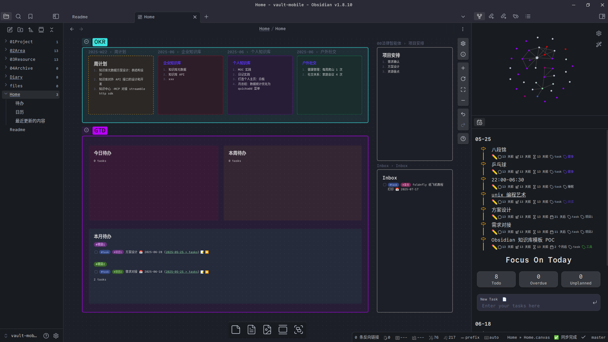

# obsidian-template


## 目录结构

```bash
# obsidian库
├── vault-mobile：我的个人obsidian库模板
├── vault-SuitCase：基于SuitAgent 搭建诉讼法律智能体
## vault-mobile的目录结构
│   ├── 01Project
│   ├── 02Area
│   ├── 03Resource
│   ├── 04Archive
## 日记目录
│   ├── Diary
## 主页
│   ├── Home.canvas
```


